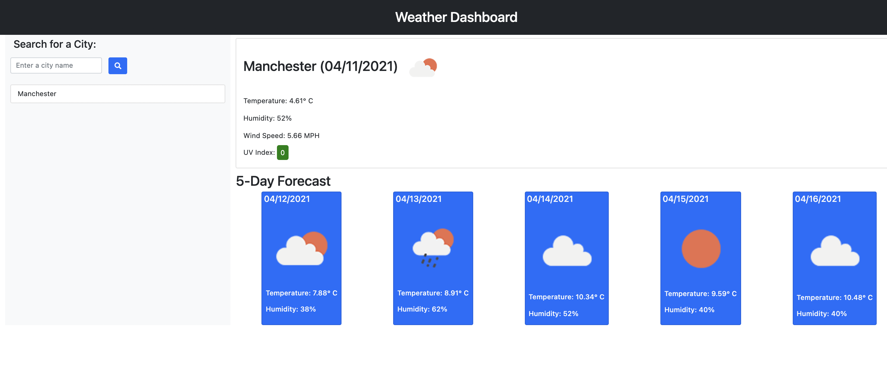

# Weather Dashboard

## Description

Dynamic weather dashboard project that uses the Current Weather Data API and One Call API from Open Weather Map to retrieve current weather data by city name and a 5-day forecast for that city.

## What did I do?

- Created a search form so users can input a city name to find out its current weather and 5-day forecast
- Used async and await functions to fetch current weather data and 5-day forecast data
- Rendered current weather data and 5-day forecast cards based on the user-inputted city name
- Used local storage to save user-inputted city names so they could return to the page and click on the city name list item for live weather and future forecast data
- Added dynamic colouring based on the UV index value

## Screenshot

## Link to deployed application:

https://gemmac-coder.github.io/Weather_Dashboard/
